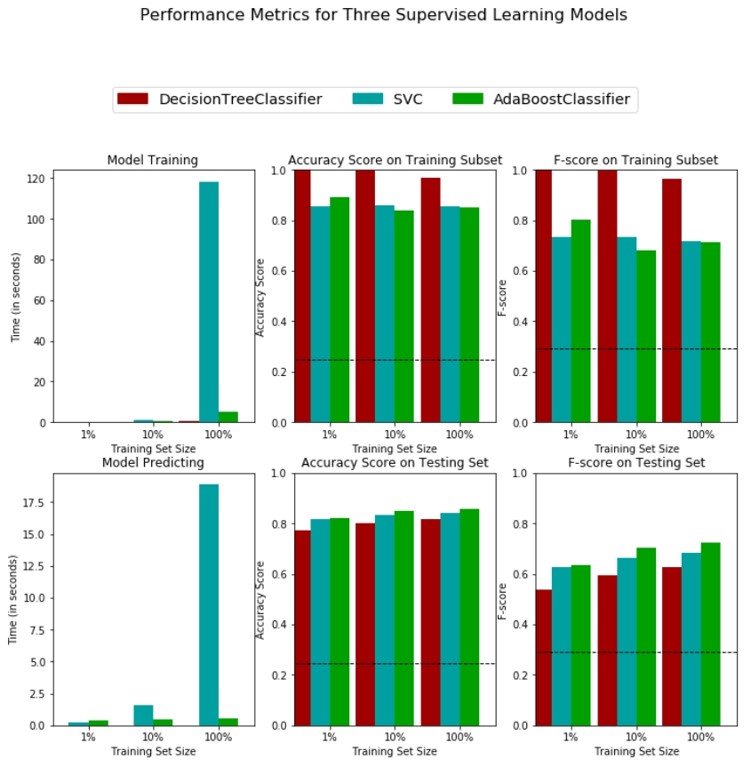
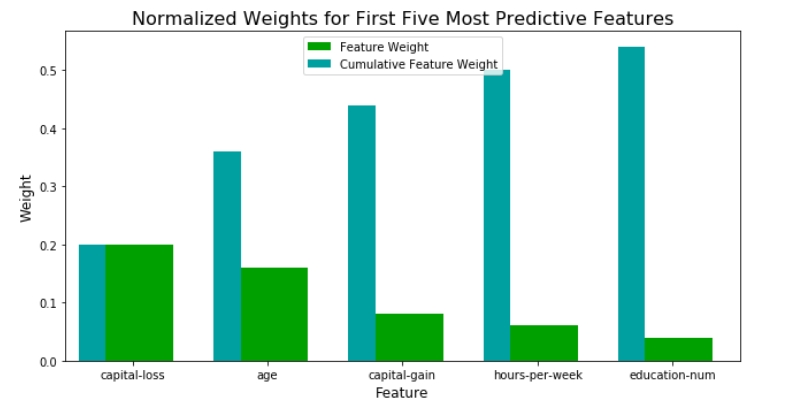

# Finding Donors for CharityML

## Introduction
The goal of this project is to help a fictitious charity organization (CharityML) to develop a supervised learning model that can accurately predict whether an individual makes more than $50,000 annually. Understanding an individual's income can help this charity better understand which potential donors they should reach out and the amount of  donation to request.

The detailed code is in the **[`finding_donors.ipynb`](https://github.com/ustcdj/Finding_Donors/blob/master/finding_donors.ipynb)** notebook.

## Data

The modified census dataset consists of approximately 32,000 data points, with each datapoint having 13 features. This dataset is a modified version of the dataset published in the paper *"Scaling Up the Accuracy of Naive-Bayes Classifiers: a Decision-Tree Hybrid",* by Ron Kohavi. You may find this paper [online](https://www.aaai.org/Papers/KDD/1996/KDD96-033.pdf), with the original dataset hosted on [UCI](https://archive.ics.uci.edu/ml/datasets/Census+Income). More details about the data schema is at the end.

## Installation

The code was developed using the Anaconda distribution of Python, versions 3.8.1. Python libraries used are `numpy`, `pandas`,  `sklearn`, `matplotlib`

## Summary of Analysis

The data is relatively clean, but needs some preprocessing. I performed:
1. log transformations on features that are highly skewed
2. scaling on numerical features to ensures that each feature is treated equally, so feature importance comparison is easy
3. one-hot encoding for categorical features
4. shuffle and split into train and test data sets

In addition to a naive predictor, I applied three supervised algorithms:
1. Decision Tree
2. Support Vector Machines
3. Ensemble Methods (AdaBoost)

I selected F-score (beta = 0.5) as the metric for evaluating model's performance. Beta is set at 0.5 to put more emphasis on precision. The model's ability to precisely predict those that make more than $50,000 is more important than the model's ability to recall those individuals. In short, false positive is worse than false negative.

Then I created a training and predicting pipeline to quickly and effectively train models and perform predictions on the testing data. From preliminary results, AdaBoost model proves to be the best classifier in terms of overall accuracy, F-score and training time. I further optimized the model using GridSearchCV. The final model has an accuracy score of .86 and F-score of .73.

I also identified top five most important features that can predict whether an individual makes at most or more than $50,000. They are listed in order below:
1. capital-loss: the more to lose, the less chance to donate possibly
2. age: the older, the more capital gain possibly
3. capital-gain: the more to make, the better chance to donate possibly
4. hours-per-week: the more hours per week, the more capital gain possibly
5. education-num: the more years education, the more capital gain possibly

I also tried to train the model on the same training set, but with only the top five most important features. The reduced model has an accuracy score of .83 and F-score of .68, 3.2% less accuracy, and 7.7% less F-score compared to the full model. If shorter training time is preferred, I'd consider using the reduced model.

## Data Schema
**Features**
- `age`: Age
- `workclass`: Working Class (Private, Self-emp-not-inc, Self-emp-inc, Federal-gov, Local-gov, State-gov, Without-pay, Never-worked)
- `education_level`: Level of Education (Bachelors, Some-college, 11th, HS-grad, Prof-school, Assoc-acdm, Assoc-voc, 9th, 7th-8th, 12th, Masters, 1st-4th, 10th, Doctorate, 5th-6th, Preschool)
- `education-num`: Number of educational years completed
- `marital-status`: Marital status (Married-civ-spouse, Divorced, Never-married, Separated, Widowed, Married-spouse-absent, Married-AF-spouse)
- `occupation`: Work Occupation (Tech-support, Craft-repair, Other-service, Sales, Exec-managerial, Prof-specialty, Handlers-cleaners, Machine-op-inspct, Adm-clerical, Farming-fishing, Transport-moving, Priv-house-serv, Protective-serv, Armed-Forces)
- `relationship`: Relationship Status (Wife, Own-child, Husband, Not-in-family, Other-relative, Unmarried)
- `race`: Race (White, Asian-Pac-Islander, Amer-Indian-Eskimo, Other, Black)
- `sex`: Sex (Female, Male)
- `capital-gain`: Monetary Capital Gains
- `capital-loss`: Monetary Capital Losses
- `hours-per-week`: Average Hours Per Week Worked
- `native-country`: Native Country (United-States, Cambodia, England, Puerto-Rico, Canada, Germany, Outlying-US(Guam-USVI-etc), India, Japan, Greece, South, China, Cuba, Iran, Honduras, Philippines, Italy, Poland, Jamaica, Vietnam, Mexico, Portugal, Ireland, France, Dominican-Republic, Laos, Ecuador, Taiwan, Haiti, Columbia, Hungary, Guatemala, Nicaragua, Scotland, Thailand, Yugoslavia, El-Salvador, Trinadad&Tobago, Peru, Hong, Holand-Netherlands)

**Target Variable**
- `income`: Income Class (<=50K, >50K)

## Acknowledgements
Special thanks to Udacity for creating this awesome project.
